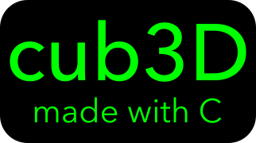

This project is inspired by the world-famous eponymous 90’s game, which was the first FPS ever. It will enable you to explore ray-casting. Your goal will be to make a dynamic view inside a maze, in which you’ll have to find your way.

## Gameplay preview

## How to run

Type make in your terminal and after compilation type ./cub3D to run the game in MACOS

If running on Linux type `sudo apt-get install libbsd-dev libx11-dev libxext-dev`
You must also uncomment the Linux specific attributes in the Makefile and change the path to the minilibx-linux in the cub3D.h file
Then type make in your terminal and after compilation type ./cub3D to run the game in Linux

## What I learned from this project

This project requires you to learn a lot about computer graphics which I had not had experience with before this project. You are limited to a very basic graphics library (minilibx) which requires you to print the game pixel by pixel and frame by frame to the screen. I improved my knowledge and skills in the C programming language, data structures, and learned how to implement a raycasting engine and associated trigonometry.

## Resources

https://courses.pikuma.com/courses/raycasting-c 
https://github.com/gustavopezzi/raycasting/tree/master/raycasting-c 
https://harm-smits.github.io/42docs/projects/cub3d 
https://github.com/id-Software/wolf3d 
https://www.youtube.com/watch?v=gYRrGTC7GtA&t=321s 
https://github.com/qst0/ft_libgfx 
https://github.com/keuhdall/images_example/blob/master/example.c 
https://qst0.github.io/ft_libgfx/man_mlx_loop.html 
https://www.allegro.cc/forums/thread/355015 
https://medium.com/sysf/bits-to-bitmaps-a-simple-walkthrough-of-bmp-image-format-765dc6857393
