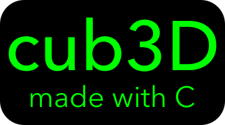

# cub3D 
This project is inspired by the world-famous eponymous 90’s game, which was the first FPS ever. It will enable you to explore ray-casting. Your goal will be to make a dynamic view inside a maze, in which you’ll have to find your way.

## Gameplay preview

